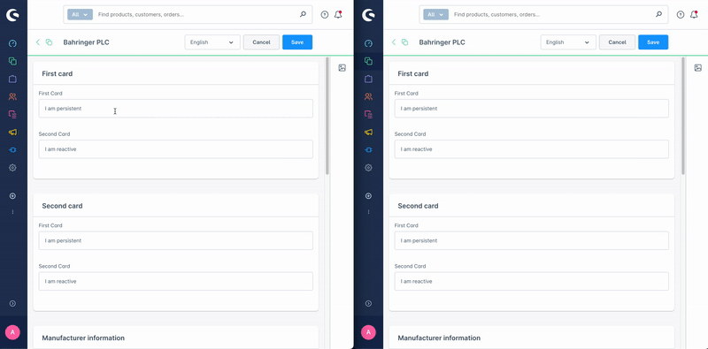

# useSharedState

The `composables.useSharedState` function allows you to create globally accessible state in your app. The state defined within this composable has a unique key, and any other part of the app that uses the same composable with the same key will access the same data.

The shared state is reactive, meaning that when you update the data in one place, all other places that access the same shared state will be automatically updated as well. This feature is particularly useful when you need to pass data to different locations, such as modals or locations outside the current iFrame. The shared state is also saved locally to the user's machine using IndexedDB, ensuring persistence even after refreshes or when the user is using multiple tabs.

The value stored within the shared state can be any data type that can be serialized to JSON. Additionally, we have added support for Entities and EntityCollections.



#### Usage:  
```ts
// Inside a Vue component setup
import { composables } from '@shopware-ag/admin-extension-sdk';
const { useSharedState } = composables;

const mySharedStateValue = useSharedState('myUniqueKeyForTheSharedState', 'myInitialDataValue');
```

#### Parameters
| Name           | Required | Description                                                               |
| :------------- | :------- | :------------------------------------------------------------------------ |
| `key`          | true     | The unique key used to share the state across different places            |
| `initial data` | true     | The initial data value used when no data exists in the local shared state |
