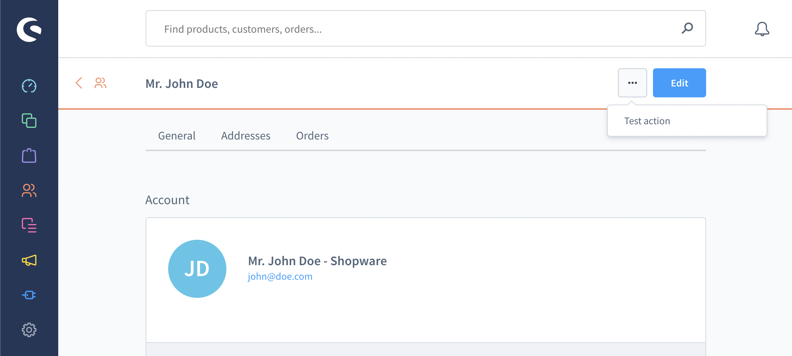

# Action button

#### Usage:  
```ts
ui.actionButton.add({
    action: 'your-app_customer-detail-action',
    entity: 'customer',
    view: 'detail',
    label: 'Test action',
    callback: (entity, entityIds) => {
        // TODO: do something
    },
});
```

#### Parameters
| Name                 | Required | Description                                                                                              |
| :------------------- | :------- | :------------------------------------------------------------------------------------------------------- |
| `action`             | true     | A unique name of your action                                                                             |
| `entity`             | true     | The entity this action is for possible values: `product`, `order`, `category`, `promotion` or `customer` |
| `view`               | true     | Determines if the action button appears on the listing or detail page                                    |
| `label`              | true     | The label of your action button                                                                          |
| `callback`           | true     | The callback function where you receive the entity and the entityIds for further processing              |

### Calling app actions
As an app developer you may want to receive the information of the callback function server side.
The following example will render the same action button as the above example but once it gets clicked you will receive a POST request to your app server.
**This will only work for apps. Plugin developers need to use a api client directly in there callback.**.

```ts
ui.actionButton.add({
    action: 'your-app_customer-detail-action',
    entity: 'customer',
    view: 'detail',
    label: 'Test action',
    callback: (entity /* "customer" */, entityIds /* ["..."] */) => {
        app.webhook.actionExecute({
            url: 'http://your-app.com/customer-detail-action',
            entityIds,
            entity,
        })
    },
});
```

#### Example

