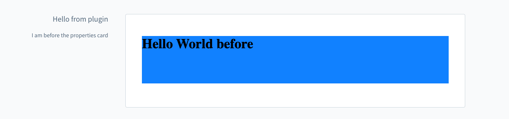

# Component Section

## Add
Add a new component to a component section.

### General usage

#### Usage:  
```ts
sw.ui.componentSection.add({
    component: 'the-component', // Choose the component which you want to render at the componet section
    positionId: 'the-position-id-of-the-component-section', // Select the positionId where you want to render the component
    props: {
        ... // The properties are depending on the component
    }
})
```

#### Parameters
| Name        | Required | Default | Description                                    |
| :---------- | :------- | :------ | :--------------------------------------------- |
| `component` | true     |         | Choose the component which you want to render. |

#### Return value:
This method does not have a return value.

## Available components

### Card

#### Properties:
| Name         | Required | Default | Description                        |
| :----------- | :------- | :------ | :--------------------------------- |
| `title`      | false    |         | The main title of the card         |
| `subtitle`   | false    |         | The subtitle of the card           |
| `locationId` | true     |         | The locationId for the custom view |

#### Usage:
```js
ui.componentSection.add({
    component: 'card',
    positionId: 'sw-product-properties__before',
    props: {
        title: 'Hello from plugin',
        subtitle: 'I am before the properties card',
        locationId: 'my-awesome-app-card-before'
    }
})
```

#### Example
