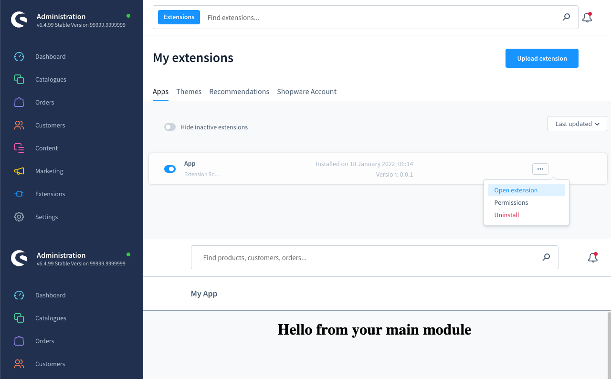

# Main module

### Add main module
Add a main module to your extension. The content of the main module is determined by your `locationId`. 
A specific view or a set of actions can be triggered based on the `locationId`.

#### Usage:  
```ts
ui.mainModule.addMainModule({
    heading: 'My App',
    locationId: 'main-location-id',
});
```

#### Parameters
| Name                 | Required | Default        | Description                                                   |
| :------------------- | :------- | :------------- | :------------------------------------------------------------ |
| `heading`            | true     |                | The heading displayed in your module                          |
| `locationId`         | true     |                | The Id for the content of the module                          |
| `displaySearchBar`   | false    | true           | Toggles the sw-page search bar on/off                         |

#### Example

```ts
import { location, ui } from '@shopware-ag/admin-extension-sdk';

// General commands
if (location.is(location.MAIN_HIDDEN)) {
    // Add the main module
    ui.mainModule.addMainModule({
        heading: 'My App',
        locationId: 'main-location-id',
    });
}

// Render your custom view
if (location.is('main-location-id')) {
    document.body.innerHTML = '<h1 style="text-align: center">Hello from your main module</h1>';
}
```
