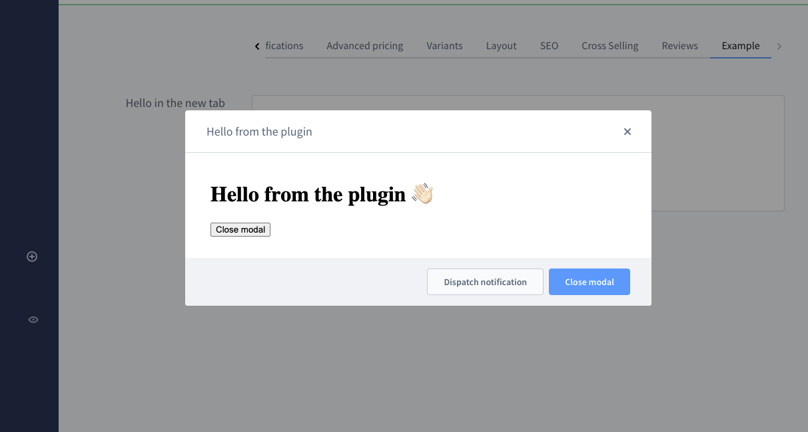

# Modals

### Open modal
Open a new modal in the current view. The content of the modal is determined by your `locationId`.

#### Usage:  
```ts
ui.modal.open({
    title: 'Your modal title',
    locationId: 'your-location-id',
    variant: 'large',
    showHeader: true,
    closable: true
    buttons: [
        {
            label: 'Dispatch notification',
            method: () => {
                notification.dispatch({
                    message: 'Hello from the modal',
                    title: 'Modal example'
                })
            }
        },
        {
            label: 'Close modal',
            variant: 'primary',
            method: () => {
                ui.modal.close({
                    locationId: 'your-location-id'
                })
            }
        }
    ],
})
```

#### Parameters
| Name         | Required | Default   | Description                                                                                                                                    |
| :----------- | :------- | :-------- | :--------------------------------------------------------------------------------------------------------------------------------------------- |
| `title`      | true     |           | The title of the modal                                                                                                                         |
| `locationId` | true     |           | The id for the content of the modal                                                                                                            |
| `variant`    | false    | 'default' | Determine the size of the modal. Possible values are 'default', 'small', 'large' and 'full'                                                    |
| `showHeader` | false    | true      | Enable the header in the modal which contains the title                                                                                        |
| `closable`   | false    | true      | If this is set to `false` then the modal can only be closed programmatically                                                                   |
| `buttons`    | false    | []        | This array contains [button configurations](../../../api/modules/ui_modal.md#buttonprops) which will render buttons in the footer of the modal |

#### Example

```ts
ui.modal.open({
    title: 'Hello from the plugin',
    locationId: 'my-awesome-app-hello-world-modal',
    buttons: [
        {
            label: 'Dispatch notification',
            method: () => {
                notification.dispatch({
                    message: 'Hello from the modal',
                    title: 'Modal plugin'
                })
            }
        },
        {
            label: 'Close modal',
            variant: 'primary',
            method: () => {
                ui.modal.close({
                    locationId: 'my-awesome-app-hello-world-modal'
                })
            }
        }
    ]
})
```

### Close modal
Closes an opened modal. You need use the correct `locationId` of the modal which should get closed.

#### Usage:  
```ts
ui.modal.close({ locationId: 'your-location-id' })
```

#### Parameters
| Name         | Required | Default | Description                                         |
| :----------- | :------- | :------ | :-------------------------------------------------- |
| `locationId` | true     |         | The locationId of the modal which should get closed |