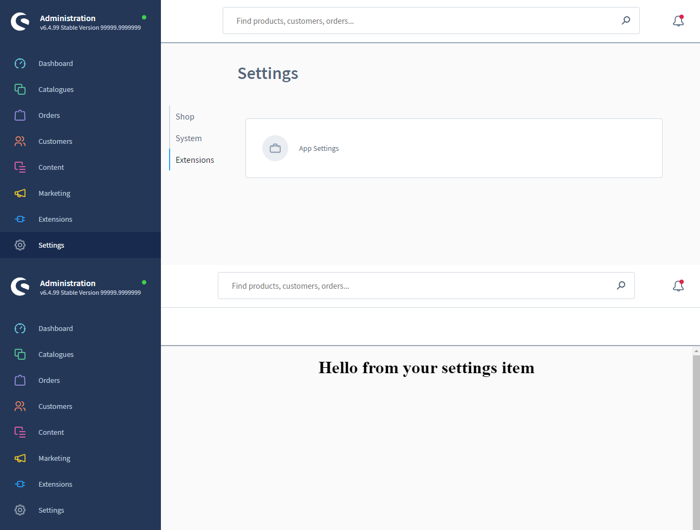

# Settings Item

### Add settings item
Add a new settings item to the Shopware settings. The content of the settings item module is determined by your `locationId`. 
A specific view or a set of actions can be triggered based on the `locationId`.

#### Usage:  
```ts
ui.settings.addSettingsItem({
    label: 'App Settings',
    locationId: 'settings-location-id',
    icon: 'default-object-books',
    displaySearchBar: true,
    tab: 'plugins',
});
```

#### Parameters
| Name                 | Required | Default        | Description                                                   |
| :------------------- | :------- | :------------- | :------------------------------------------------------------ |
| `label`              | true     |                | The label of the tab bar item                                 |
| `locationId`         | true     |                | The id for the content of the settings item module            |
| `icon`               | true     |                | The icon to display in your settings item                     |
| `displaySearchBar`   | false    | true           | Toggles the sw-page search bar on/off                         |
| `tab`                | false    | 'plugins'      | Determines in which tab your settings item will be displayed  |

### Getting the right icon
Assuming that your editor supports TypeScript, you should get auto-completion for valid `icon` values.
In case that doesn't work take a look at the list [here](https://github.com/shopware/admin-extension-sdk/blob/main/src/icons.ts).

#### Example

```ts
import { location, ui } from '@shopware-ag/admin-extension-sdk';

// General commands
if (location.is(location.MAIN_HIDDEN)) {
    // Add the settings item to the plugins tab
    ui.settings.addSettingsItem({
        label: 'App Settings',
        locationId: 'settings-location-id',
        icon: 'default-object-books',
        displaySearchBar: true,
        tab: 'plugins',
    });
}

// Render your custom view
if (location.is('settings-location-id')) {
    document.body.innerHTML = '<h1 style="text-align: center">Hello from your settings item</h1>';
}
```
