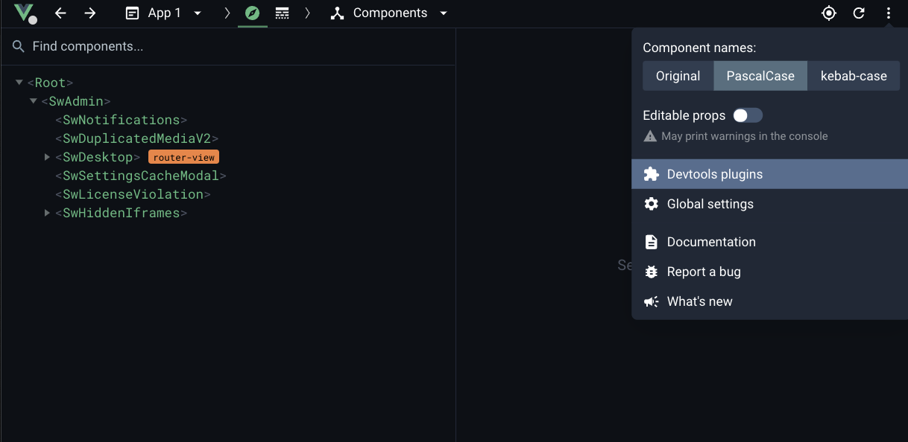
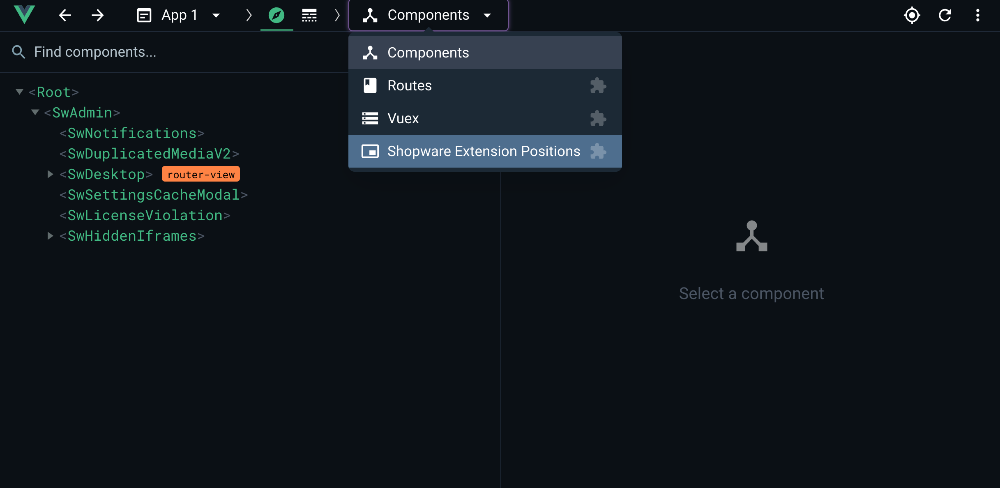

# Vue Devtools
The administration has many extension capabilties. Many of them are components with an unique positionId. It can be
difficult to find out their id to extend them. You need to manually look in the core source code to find out the id.

The better way is using the Vue devtools plugin. It is preinstalled in every Shopware administration so that you can
find out the ids in an interactive and visual way.

## Prerequisites:
You need to have the Vue Devtools installed. The plugin API for the Vue Devtools is only available in the versions 6+ (Currently only in the [beta channel](https://chrome.google.com/webstore/detail/vuejs-devtools/ljjemllljcmogpfapbkkighbhhppjdbg). You can install both parallel.). If you are using an older version then this plugin will not work.

After installing the browser extensions you should be able to open the devtools in the development/watch mode of the administration. To check if the admin plugin works you can go to the settings and check if the Shopware Admin plugin is installed and enabled:

## Finding extension capabilites
Navigate to the page which you want to extend. In our example we go to the product detail page in the tab specifications.

Now you can open the plugin in the top dropdown menu:

You should see a list on the left side where all extension capabilities are listed. If you click on any of them you will directly see them highlighted in the administration.

In the inspector of the devtools you will see more information about the extension point. You can see the `Property` value which you can look in the API Reference documentation. Then you know how to use your selected extension point and which capabilities are available. And in most cases you need the `positionId` which is also shown in the inspector. The positionId is a unique identifer so that you extend not every area but only your selected one.

