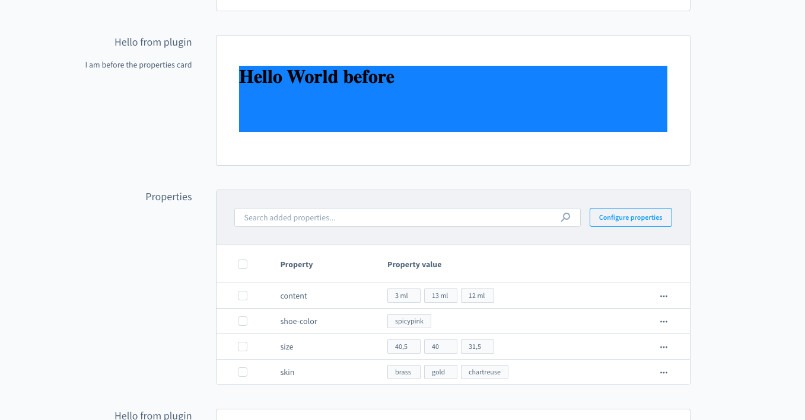

# Component sections

In most cases extension developers will directly use the extension capabilities of the UI components (e.g. adding tab items, adding button to grid, ...). This will cover most needs of many extensions. But in cases where a extension need special solutions which aren't feasible with the given extension they can use a feature named `Component Sections`. These are sections where any extension developer can inject components.

These components are prebuilt (like cards) and contain in most cases custom [location](./locations.md) where the extension has the full freedom to render anything.

### Example:

```js
if (location.is(location.MAIN_HIDDEN)) {
  // Choose a position id where you want to render a custom component
  sw.ui.componentSection('sw-manufacturer-card-custom-fields__before').add({
      // The Component Sections provides different components out of the box
      component: 'card', 
      // Props are depending on the type of component
      props: {
          title: 'Hello from plugin',
          subtitle: 'I am before the properties card',
          // Some components can render a custom view. In this case the extension can render custom content in the card.
          locationId: 'my-app-card-before-properties'
      }
  })
}

// Render the custom UI when the iFrame location matches your defined location
if (sw.location.is('my-app-card-before-properties')) {
    document.body.innerHTML = '<h1>Hello World before</h1>';
    document.body.style.background = 'blue';
}
```



If you want to render tabs inside the `card` component section, we provide a way to do so:
```js
if (location.is(location.MAIN_HIDDEN)) {
  // Choose a position id where you want to render a custom component
  sw.ui.componentSection.add({
      // The Component Sections provides different components out of the box
      component: 'card', 
      // Props are depending on the type of component
      props: {
          title: 'Hello from plugin',
          subtitle: 'I am before the properties card',
          // Render tabs and custom tab content with the provided location id
          tabs: [
              {
                  name: 'example-tab-1',
                  label: 'First tab', 
                  locationId: 'example-tab-1'
              },
              {
                  name: 'example-tab',
                  label: 'Second tab',
                  locationId: 'example-tab-2'
              }
          ],
      }
  })
}

// Render the custom UI for different tab with the location id
if (sw.location.is('example-tab-1')) {
  document.body.innerHTML = '<h1>My first tab</h1>';
  document.body.style.background = 'blue';
}

if (sw.location.is('example-tab-2')) {
  document.body.innerHTML = '<h1>My second tab</h1>';
  document.body.style.background = 'yellow';
}
```


