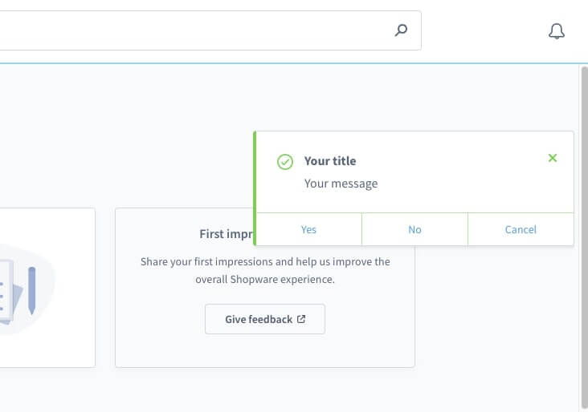

# Notification

### Dispatch a notification



#### Usage:  
```ts
function alertYes() {
  alert('Yes');
}

sw.notification.dispatch({
    title: 'Your title',
    message: 'Your message',
    variant: 'success',
    appearance: 'notification',
    growl: true,
    actions: [
        {
            label: 'Yes',
            method: alertYes
        },
        {
            label: 'No',
            method: () => {
                alert('No')
            }
        },
        {
            label: 'Cancel',
            route: 'https://www.shopware.com',
            disabled: false,
        }
    ]
})
```

#### Parameters:
| Name | Required | Default | Description |
| :------ | :------ | :------ | :------ |
| `title` | true | | The title of the notification |
| `message` | true | | The message of the notification |
| `variant` | false | `info` | Change the variant of the notification. Available variants are `success`, `info`, `warning` and `error`.|
| `appearance` | false | `notification` | Change the look of the notification. Use `system` for technical application notifications. Otherwise use `notification`.|
| `growl` | false | `true` | Should the notification directly be visible? |
| `actions` | false | `[]` | Add buttons to the notification. Each button with a `label` can trigger a `method` or open a `route` (internal route or external link). Buttons can also be disabled with the attribute `disabled`. |

#### Return value:
Returns a Promise without data.
