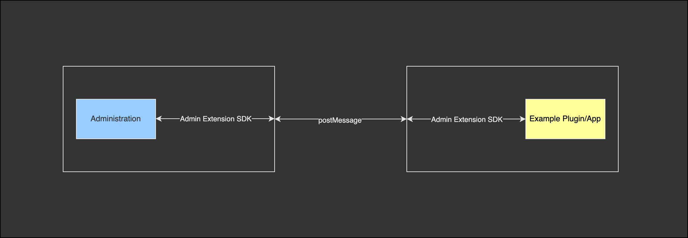

# How it works

The Admin Extension SDK provides wrapper methods for a better development experience. It abstracts and hides the more
complex logic behind a simple API. This makes it easier for app and plugin developer to create their solutions and focus
more on business details instead of technical details.

## Admin communication

Technically the apps and plugins are communicating to the administration via the [postMessage API](https://developer.mozilla.org/en-US/docs/Web/API/Window/postMessage). It is a secure communication channel between different windows. In most cases it will be used to communicate
from a iFrame to the main window and the other way around.

The Extension SDK works in the same way but it uses a hybrid approach. Every method is callable within a iFrame and also
from the same window. This allows apps (in iFrames) and plugins (in the same window) to use the same API.



Normally the postMessage API is very limited and not very friendly to use. You can send string values from one window to
another. This isn't very handy to use for smooth development. To provide a smoother experience we wrote some helper methods to
make working with the postMessage API a breeze.

The helper methods can be found in the `channel` file. It has different methods for easier communication. The most important ones are `send` and `handle`. They are responsible for sending and handling the data.

Do give you an better understanding how it works we go trough an example.

### Example workflow

Let's imagine that a app or plugin calls the `context.getLanguage` method from the Extension SDK:

```js
// from app/plugin
const language = await sw.context.getLanguage();
```

What happens in the background? The method is a wrapper for the `send` method in the `channel`. When you use it it will call `send` with a predefined type:

```js
// from app/plugin
send('contextLanguage', {});
```

Each message has an unique type. They are hidden for plugin and app developers and are only responsible for the underlying handling. With the unique type we know in the admin what type of request it is and what response it expects.

The `send` method is doing now some magic in the background. It creates a data object with following properties:

```js
{
  _type: 'contextLanguage',
  _data: {},
  _callbackId: 'aRand0mGeneratedUniqueId'
}
```

The `_type` property is for the recognition of the request type. The `_data` property is custom data which will be added by the app or plugin. E.g. the title, message and more for a notification. And the `_callbackId` is needed so that the administration can send the data back with the ID and the sender can recognize it and use the data.

This object will be sent as a stringified JSON object to the administration window via the postMessage API.

<!-- Additionally it creates a event listener which is looking for a message with the matching callback ID. When the admin sends a response back the listener can get the values and return them as a Promise value to the original callee of the `send` method. -->

Now let's have a look at what needs to happen on the administration side.

```js
// at administration
handle('contextLanguage', () => {
    return {
        languageId: Shopware.Context.api.languageId,
        systemLanguageId: Shopware.Context.api.systemLanguageId,
    };
});
```

It uses the `handle` method which is also a helper method of the `channel`. You see that the type matches the sender type. And in the second argument it provides a method which returns the data.

This method reacts to every `contextLanguage` request and send the data values back to the source of the request. It also creates a object with meta information which are needed for the original `send` window:
```js
{
  _type: 'contextLanguage',
  _response: { languageId: '1a2b3c...', systemLanguageId: '9f8g7h...', },
  _callbackId: 'aRand0mGeneratedUniqueId'
}
```

The source who will send the request is adding a new event listener before it sends the message. This event listener listen to all incoming messages and if any of these messages is matching the type and the callback ID of the sent message then it will handle the data.

In our case it will get back an stringified object with the language information. These will parsed and returned to the first method call:

```js
// from app/plugin
const language = await sw.context.getLanguage();

// language = { languageId: '1a2b3c...', systemLanguageId: '9f8g7h...', }
```

And this was it! The app or plugin has got the data from the administration. It looks like a simple call. But it does a lot in the background.

## Sending methods
In normal cases you can't add methods to JSON objects which will get stringified. In our case we think it would makes the life of many developers easier if they can also use their methods in the calls.

To handle these edge-case we are converting the methods to information objects like this:
```js
{
  __type__: '__function__',
  id: 'theUniqueFunctionId' // will be generated uniquely
}
```

The method will be saved in a `methodRegistry` where the unique ID can be used as an identifier.

The receiver of the object convert this object back to a method which would trigger the original method. This can't be done directly because we do not have direct access to the method. To solve this problem we send a special postMessage call to the original source. This call contains all arguments of the called method and the unique ID of the method:

```js
send('__function__', {
  args: args,
  id: id,
})
```

The sender gets the message and execute the method with the matching ID with the given arguments. The return value will be then sent back to the converted method in the receiver.

This complex logic is also abstracted. To use it: just add methods to
the data. It will be converted and handled automatically.